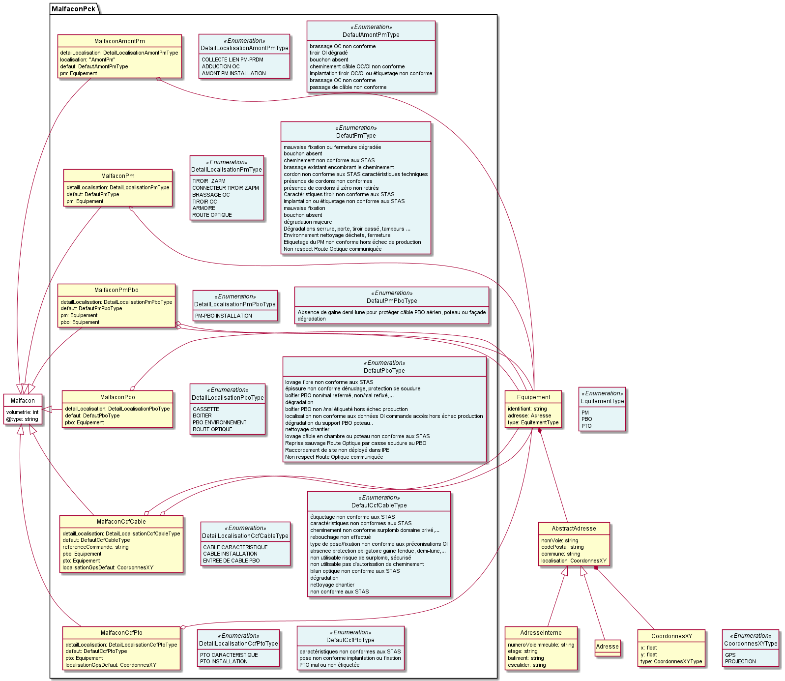

# Malfaçon
## Modèle de données

## Lien ReDoc
La documentation de l'API est disponible sur https://redocly.github.io/redoc/?url=https://raw.githubusercontent.com/before-interop/malfacon/feature/malfacon_oi_oc/malfacon-oi-oc.yaml
## Diagramme de séquence
//TODO
