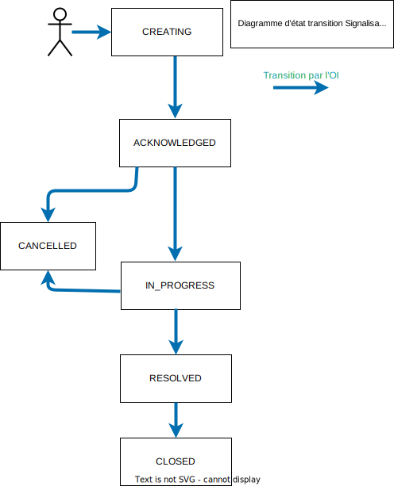
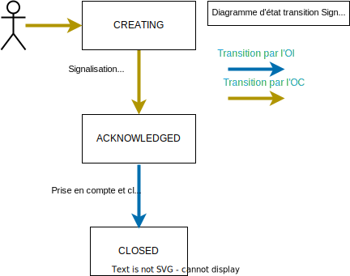

# Protocole Interop Malfaçon

# Table des matières
1. [Introduction](#introduction-api-malfaçon)
 ### 2. Malfaçon signalée par l'OI vers l'OC
 #### 2.1 Malfaçon "Imputable" signalée par l'OI vers l'OC
 2.1.1 [Cycle de vie et règles de transition entre états](#cycle-de-vie-dune-malfaçon-imputable-oi-vers-oc-non-critique)

2.1.2 [Gestion des compteurs](#liste-des-différents-compteurs-utilisés-dans-le-process-malfaçons-lors-dune-signalisation-oi-vers-oc)
 #### 2.2 Malfaçon "Non Imputable" ou "Critique" signalée par l'OI vers l'OC
2.2.1 [Cycle de vie et règles de transition entre états](#cycle-de-vie-dune-malfaçon-non-imputable-ou-critique-de-loi-vers-oc)
#### 2.3 Diagrammes de séquence de cas d'utilisation de Malfaçons signalée par l'OI vers l'OC
2.3.1 [Diagramme de séquence des 11 Cas d'utilisation](#cas-dutilisation-signalisation-oi)
### 3. Malfaçon signalée par l'OC vers l'OI
3.1 [Cycle de vie](#cycle-de-vie-dune-malfaçon-oc-vers-oi)

3.2 [Diagramme de séquence du cas d'utilisation](#cas-dutilisation-signalisation-oc)

# Introduction API Malfaçon
Cette API permet la déclaration et le traitement d’une malfaçon grâce à des flux normalisés :

Une malfaçon est une non-conformité par rapport aux STAS (Spécification Technique d’Accès aux Services) ou règles de l’art, issue de travaux menés dans le cadre d'une prestation de production ou de SAV sur un accès (PM/PBO/PTO). Les malfaçons que l’on constate le plus souvent sont : un non-respect du cheminement de la jarretière, une non-conformité de la jarretière (couleur, diamètre, longueur…) mais aussi des déchets laissés sur place (sachet plastique, chute de jarretière…) ou des dégradations (serrure cassée…). La Malfaçon se distingue de la notion de dysfonctionnement dont est ici rappelée la définition Interop’Fibre : un dysfonctionnement est une problématique qui rend impossible l’adduction du réseau d’un OC au PM mis à disposition par un OI.

Les signalisations peuvent être :
1) De l'OI vers l'OC :

Cas 1 : Malfaçon imputable de l'OI vers l'OC : reprise attendue de la part de l'OC

Il s'agit alors de Malfaçon non critique imputable à un seul OC : c'est alors une notification appelant action corrective de la part de l’OC destinataire. Si l'OC ne corrige pas dans les délais attendus, alors l'OI effectue la correction lui-même et facturera l'OC pour cela.

Cas 2 : "Malfaçon Critique"  ou "Malfaçon non imputable" à un seul OC : la reprise est effectuée par l'OI

Dans ces deux sous-cas ci-dessous, l'OI corrige la malfaçon lui-même et facturera l'OC (ou les OC suivant le sous cas):

Sous-Cas 2.1 : Malfaçon critique : il peut s'agir d'une signalisation imputable ou non imputable à un seul OC. C'est alors une notification à l'OC (ou aux OC) n’appelant pas action de sa/leur part car la reprise sera effectuée par l'OI compte-tenu de son aspect critique (c’est-à-dire pouvant présenter un danger grave et imminent pour les personnes et entrainer la responsabilité de l'OI à ce titre). L'aspect "Critique" de la malfaçon doit alors être conforme aux travaux Interop.

Sous-Cas 2.2 : Malfaçon non imputable à un seul OC et non critique : c'est alors une notification à l'ensemble des OC concernés n’appelant pas d'action de leur part car la reprise sera effectuée par l'OI

2) De l'OC vers l'OI :

L'OC informe l'OI pour que celui-ci dépose une signalisation vers l'OC responsable. L’OC a l’origine de la remontée initiale ne suit pas le cycle de vie de la malfaçon et ne sera pas informé de la reprise de la malfaçon qu’il a signalée.  La signalisation de la malfaçon par un OC vers un OI est une remontée d’information qui n’implique pas d’engagement de l’OC sur son niveau de précision : cette signalisation constitue une information complémentaire pour l’OI dans le cadre de l’exploitation de son réseau.

#### Important
- Un signalisation est créée par typologie de malfaçon à l'OC imputable, sans regroupement par élément d’infra
- et elle doit obligatoirement, sauf exception (cf ci-dessous), porter à la détection et à la résolution une photo au format JPEG prouvant la malfaçon ainsi que sa résolution. Il sera possible de joindre plusieurs photos à une signalisation mais une et une seule devra porter la notion de "photo principale" à la détection, et à la "résolution". Si l'OI ou l'OC attache une photo comme "photo principale", de détection ou résolution, alors qu'il en existe déjà une, le système enlèvera automatiquement la notion de principale à la photo précédente qui portait cette mention.

Exception : Dans les cas ci-dessous, la photo n'est pas obligatoire mais l'OI doit fournir la route optique constatée (obligatoire) et la route optique théorique (facultatif) au sein d'un "attachment", à la détection, et il doit en être de même à la résolution :
- PBO	/ ROUTE OPTIQUE /	Reprise sauvage Route Optique par casse soudure au PBO
- PBO	/ ROUTE OPTIQUE	/ Raccordement de site non déployé dans IPE
- PBO	/ ROUTE OPTIQUE	/ Non respect Route Optique communiquée
- PM	 / ROUTE OPTIQUE	/ Non respect Route Optique communiquée

## Swagger

https://julienb-o.github.io/malfacon/

## Types de Malfaçons
Les différents types de malfaçons sont :

# Cycle de vie d'une Malfaçon Imputable OI vers OC non critique

#### Gestion des pièces jointes et commentaires
Une pièce jointe ne peut être ajoutée à une malfaçon que dans les états : CREATING, IN_PROGRESS, PENDING et RESOLVED
Ces pièces jointes pourront être de type : csv, jpeg, jpg, png, svg, pdf, ods, odt, xlsx, docx

Il est également possible d'ajouter un commentaire lors de chaque transition (changement de statut) au sein du champs statusChangeDetails (obligatoire dans le cas de certaines transitions).

## Liste des différents compteurs utilisés dans le process malfaçons lors d'une signalisation OI vers OC
Le protocole Interop n’harmonise pas les délais car ils relèvent du domaine contractuel propre à chaque opérateur. Néanmoins, les opérateurs doivent mettre en place des compteurs pour les cas décrits ci-dessous. Les valeurs sont propres à chaque OC/OI et seront formalisées dans les contrats.
Ces compteurs permettent de s'assurer du bon avancement du ticket, y compris en gérant de façon automatique des transitions en cas d'absence de réponses OI ou OC.

### Délai max de reprise OC :
Compteur totalResolutionOcDuration qui démarre au passage du ticket à Acknowledged qui correspond à la transmission de la signalisation par l’OI.
Ce délai correspond au temps maximum alloué à l’OC pour résoudre la malfaçon.
Ce délai peut cependant s’allonger suite à l’application de « gels » :
- Quand l’OC demande des compléments d’informations à l’OI pour traiter la malfaçon, le compteur de reprise OC est gelé le temps que l’OI réponde à la sollicitation.
- Lorsque l’OC a effectué la reprise de la malfaçon (passage du ticket à Resolved), le compteur est gelé le temps que l’OI analyse la reprise OC. En cas de rejet de résolution, le compteur redémarrera là où il en était et l’OC pourra réitérer sa reprise dans les jours restants.

Cas particulier pour les "gestions de crise" : suite à une demande OC, l'OI peut accepter d'allonger ponctuellement ce délai de résolution OC sur une période. Dans ce cas la nouvelle valeur sera mise en en remplacement de l'ancienne avec une information expliquant qu'elle a été mise à jour au cours de son cycle de vie pour raison de crise. Le filtrage des signalisations candidates à cette gestion de crise pourra être effectuée à partir du code_insee (information obligatoire d'une signalisation).

### Délai max de validation OI :
Est calculé lors de la réception par l’OI de la résolution envoyée par l’OC (passage du ticket à Resolved)
Ce délai correspond au temps maximum alloué à l’OI pour valider ou non, la résolution par l’OC.
Ce délai de validation OI gèle le délai de reprise OC.
Une fois ce délai dépassé, la résolution est considérée comme automatiquement validée par l’OI et le ticket doit être clôturé. Une fois le ticket clôturé, l’OI ne pourra pas facturer l’OC s’il n’est pas satisfait de sa reprise. Il devra alors ouvrir un nouveau ticket, patienter le délai de reprise OC et, si de nouveau la reprise OC ne lui convient pas, exprimer le refus de validation dans le délai imparti pour ensuite reprendre la malfaçon et facturer l’OC.

### Délai max de reprise OI:
Ce délai correspond au temps maximum alloué à l’OI pour résoudre la malfaçon.
Il démarre lors du passage à IN_PROGRESS avec resolutionOwner=OI.

### Délai max de réponse OI :
Est calculé lors d'une question posée par l'OC à l'OI (passage du ticket à Pending lorsque le porteur de résolution=OC)
L'OI a alors un délai fixé (maxPendingDate) pour apporter la réponse à l'OC qui est en attente de celle-ci. Si cette date est dépassée, le ticket passe alors automatiquement en Cancelled.

### Délai max de réponse OC :
Est calculé lors d'une question posée par l'OI à l'OC (passage du ticket à Pending lorsque le porteur de résolution=OI)
L'OC a alors un délai fixé pour apporter la réponse à l'OI qui est en attente de celle-ci. Si cette date est dépassée, le ticket passe alors automatiquement à Closed avec application de pénalités.

### Délai max de dépôt entre les tickets auprès d’un même OC sur un même élément d’infra (Gestion des compléments de signalisations) :
Il ne s'agit pas ici d'un compteur, mais plutôt d'une règle de gestion.
Afin d’optimiser les interventions terrains, l’OI doit veiller à signaler l’ensemble des malfaçons auprès d’un même OC sur un « même élément d’infra* » dans un « délai max de dépôt entre les tickets ».

Tout ticket au-delà pourra être rejeté par l’OC dès lors qu'il a déjà un ticket sous sa responsabilité en cours sur cet élément d'infra.

Remarque : Elément d’infra = PM / PB et CCF

# Détail des transitions d'une Malfaçon Imputable OI vers OC non critique

#### Initialisation : statut CREATING
Une signalisation est créée par l’OI et porte l’information ResolutionOwner = ‘OC’.
A ce stade la signalisation est en cours de création.

L'OI doit renseigner les champs :
- resolutionOwner = OC
- attributable : yes
- type
- localisationDetails
- faultDetails
- quantity
- severity (ne peut pas être Critical puisque attributable=Yes)
- la/les références équipement de la Malfaçon (ref PM et/ou ref PB et/ou ref PTO)
- ocNumber = 1
- insee_code

Règle de gestion :
- une signalisation portant sur la "présence de cordons à zéro non retirés" ne peut avoir une quantité < 5 que si il existe une autre signalisation sur le même élément d'infra déposé dans le "délai max de dépôt entre les tickets auprès d’un même OC sur un même élément d’infra"
- Sinon l'OC sera en droit de la contester

Le champs statusChangeReason = Creating

#### CREATING → ACKNOWLEDGED : complétude
La signalisation est alors complète et contient l'ensemble des informations pour l'analyse OC:
- une photo au format JPEG est présente oligatoirement illustrant la malfaçon. Il est possible d'en joindre plusieurs mais dans tous les cas une, et une seule photo, doit porter une information spécifique indiquant que c'est la photo principale de détection de la signalisation (cf swagger: proofType (ISSUE/RESOLUTION) et primary (booleen)
- sauf dans les cas ci-dessous où l'OI devra fournir la route optique constatée (obligatoire) et la route optique théorique (facultatif) :
  - PBO	/ ROUTE OPTIQUE /	Reprise sauvage Route Optique par casse soudure au PBO
  - PBO	/ ROUTE OPTIQUE	/ Raccordement de site non déployé dans IPE
  - PBO	/ ROUTE OPTIQUE	/ Non respect Route Optique communiquée
  - PM / ROUTE OPTIQUE	/ Non respect Route Optique communiquée

Le compteur de délai max de reprise démarre dès ce statut.
Le champs statusChangeReason = Acknowledged

#### ACKNOWLEDGED → REJECTED: Le ticket n'est pas jugé recevable par l'OC

Ce changement ne peut être effectué que par  l'OC et uniquement si le ticket est invalide syntaxiquement.

Le statusChangeReason est INVALID_FORMAT.

#### ACKNOWLEDGED → IN_PROGRESS: Le ticket est en cours de résolution

Ce changement est :
- soit effectué par  l'OC. Le champ statusChangeReason doit être renseigné avec Attributable_Accepted
- soit par l'OI lorsque le délai de résolution OC est atteinte. Dans ce cas, le resolutionOwner est mis à OI et le champs statusChangeReason à OC_RESOLUTION_DELAY_EXPIRED.

#### IN_PROGRESS → IN_PROGRESS: l'OI prend en charge la résolution du ticket suite dépassement délai OC
Ce changement de status ne peut être effectué que par l'OI et que si le délai de résolution par l'OC est dépassé.

L'OI doit alors :
- modifier le champs resolutionOwner qui doit être renseigné à "OI"
- Le champ statusChangeReason doit être renseigné avec OC_RESOLUTION_DELAY_EXPIRED

#### IN_PROGRESS → PENDING: demande d'information (OI/OC) ou contestation OC
Ce changement de statut peut être effectué
- par l'OC sur une malfaçon dont le ResolutionOwner='OC'
- par l'OI sur une malfaçon dont le ResolutionOwner='OI'

Lorsque cela est à l'initiative de l'OC : Cette transition a pour effet de geler le compteur de résolution OC. L'OI a alors un délai maximum pour apporter sa réponse. Le champ statusChangeReason doit être renseigné avec  :
- INFORMATION_REQUEST: demande d'information
  
ou avec un motif de contestation. L'OC ne pourra contester que 2 fois maximum une signalisation auprès de l'OI. Les motifs de contestation sont :
- CONTESTATION_PHOTO_NOT_USABLE: Photo non exploitable/flou/mal cadré
- CONTESTATION_EQUIPMENT_ERROR: confusion sur l'équipement déclaré
- CONTESTATION_DUPLICATE: le ticket est en conflit avec un autre ticket (non respect du délai max de dépôt entre les tickets auprès d’un même OC sur un même élément d’infra ). Le champ statusChangeDetails est obligatoire avec la référence du ticket en conflit.
- CONTESTATION_ORDER_PUT_INTO_SERVICE_FOR_MORE_THAN_A_YEAR : la commande d'accès date d'il y a plus d'un an. Ne s'applique qu'à des signalisations CCF.
- CONTESTATION_OI_RESPONSABILITY: jugé comme sous responsabilité OI (ex: candidat à la REC, tambours....)
- CONTESTATION_OC_ERROR: OC non concerné
- CONTESTATION_NOT_ALLOWED : autre cas. Le détail doit être fourni obligatoirement dans le statusChangeDetails

Lorsque cela est à l'initiative de l'OI : L'OC a alors un délai maximum pour apporter sa réponse. Le champ statusChangeReason doit être renseigné avec  :
- INFORMATION_REQUEST: demande d'information

#### PENDING → IN_PROGRESS: réponse OI/OC à une demande d'information ou réponse OI à une contestation OC
Ce changement de status peut être effectué par l'OI ou par l'OC.

Dans le cas de l'OI, cela fait suite à une demande d'information OC ou une contestation:
- Cette transition a pour effet de dégeler le compteur de résolution OC
- Le champ statusChangeReason doit être renseigné avec  :
  - INFORMATION_GIVEN : avec fourniture de la réponse dans le statusChangeDetails obligatoire
  - CONTESTATION_REFUSED : rejet de la contestation (deux contestations maximum par l'OC)

Dans le cas de l'OC, cela fait suite à une demande d'information OI:
Le champ statusChangeReason doit être renseigné avec INFORMATION_GIVEN avec fourniture de la réponse dans le statusChangeDetails obligatoire.

#### PENDING → CANCELED: absence de réponse OI dans les délais ou validation de la contestation
Ce changement de status ne peut être effectué que par l'OI:
- soit automatiquement lorsque le délai de réponse OI a été dépassé : le statusChangeReason est alors à OI_RESPONSE_DELAY_EXPIRED
- soit en cas de validation de la contestation OC : CONTESTATION_ACCEPTED

#### IN_PROGRESS → RESOLVED: résolution du ticket

Sur un ticket dont le champs resolutionOwner='OI', ce changement de status ne peut être effectué que par l'OI. Le champ statusChangeReason doit être renseigné avec RESOLVED_OI_ATTRIBUTABLE.

Sur un ticket dont le champs resolutionOwner='OC', ce changement de status ne peut être effectué que par l'OC. Le champ statusChangeReason doit être renseigné avec RESOLVED_OC. Le compteur de délai de résolution OC se gèle et compteur de validation OI est alors calculé.

En complément :
- le champs resolutionDate doit être renseigné
- ainsi que le champs recoveryQuantity
- et une photo obligatoire au format JPEG illustrant la résolution de la malfaçon, sauf pour les 4 cas route optique où un attachment est attendu (cf. status Acknowledged). Pour les photos, il est possible d'en joindre plusieurs mais dans tous les cas une, et une seule photo, doit porter une information spécifique indiquant que c'est la photo principale de résolution de la signalisation

#### ACKNOWLEDGED → CANCELLED : annulation du ticket par l'OI
Ce changement de status ne peut être effectué que par l'OI.
Le statusChangeReason est CANCELED.

#### IN_PROGRESS → CANCELLED : annulation du ticket par l'OI
Ce changement de status ne peut être effectué que par l'OI.
Le statusChangeReason peut être :
- OI_DELAY_EXPIRED : lorsque l'OI n'a pas répondu dans les temps aux questions / contestations OC
- CANCELED: autre cas donnant lieu à l'annulation par l'OI

#### RESOLVED → CLOSED: cloture du ticket.
Ce changement de status est effectué par l'OI. Le statusChangeReason peut être :
- RESOLVED_OC_VALIDATED
- RESOLVED_OI_VALIDATED
- OI_VALIDATION_DELAY_EXPIRED : passage automatique suite au dépassement du délai de validation OI sur une résolution OC

#### RESOLVED → IN_PROGRESS: refus OI de la résolution OC du ticket
Ce changement de status ne peut être effectué que par l'OI sur un ticket dont le ResolutionOwner='OC'.

Cette transition a pour effet de dégeler le compteur de résolution OC.

Le champ statusChangeReason doit être renseigné avec :.
- RESOLUTION_REFUSED_PARTIALLY_RESOLVED : résolution partielle
- RESOLUTION_REFUSED_PHOTO_NOT_USABLE: Photo non exploitable/flou/mal cadré
- RESOLUTION_REFUSED_EQUIPMENT_ERROR: confusion sur l'équipement déclaré
- RESOLUTION_REFUSED_NOT_REPAIRED: non résolu

#### PENDING → CLOSED: absence de réponse OC à une demande OI
Ce changement de status ne peut être effectué que par l'OI sur un ticket dont le ResolutionOwner='OI'.
L'OI a questionné l'OC pour pouvoir réparer la signalisation. En absence de réponse OC dans les temps, cette signalisation est cloturée avec le statusChangeReason à OI_RESOLUTION_IMPOSSIBLE.

# Cycle de vie d'une Malfaçon Non imputable ou Critique de l'OI vers OC

### Délai max de reprise OI:
Compteur totalResolutionOiDuration qui démarre au passage du ticket en résolution OI donc à in_Progress avec resolutionOwner=OI.
Ce délai correspond au temps maximum alloué à l’OI pour résoudre la malfaçon.

# Cycle de vie d'une Malfaçon Non imputable ou Critique de l'OI vers OC

#### Initialisation : statut CREATING
Une signalisation est créée par l’OI et porte l’information ResolutionOwner = ‘OI’.
A ce stade la signalisation n'est pas complète puisqu'aucune pièce jointe n'a été ajoutée au ticket.

L'OI a renseigné les champs :
- resolutionOwner = OI
- type
- localisationDetails
- faultDetails
- quantity
- severity (doit être Critical si attributable=Yes car résolution portée par l'OI)
- la/les références équipement de la Malfaçon (ref PM et/ou ref PB et/ou ref PTO)
- attributable : yes or no
- nombre d'OC concerné
- insee_code

Le champs statusChangeReason = Creating

#### Complétude : statut ACKNOWLEDGED
A ce statut une photo au format JPEG est présente oligatoirement illustrant la malfaçon. Il est possible d'en joindre plusieurs mais dans tous les cas une, et une seule photo, doit porter une information spécifique indiquant que c'est la photo principale de détection de la signalisation.

Le champs statusChangeReason = Acknowledged

#### ACKNOWLEDGED → IN_PROGRESS: Le ticket est en cours de résolution

Ce changement de statut est effectué par  l'OI et le champ statusChangeReason doit être renseigné, suivant le cas, avec :
- statusChangeReason = "NON_ATTRIBUTABLE"
- statusChangeReason = "CRITICAL"

#### ACKNOWLEDGED → CANCELLED : annulation du ticket par l'OI
Ce changement de status est effectué par l'OI. Le champs statusChangeReason = Cancelled

#### IN_PROGRESS → CANCELLED : annulation du ticket par l'OI
Ce changement de status est effectué par l'OI et correspond au dépassement du délai de reprise OI.
Le statusChangeReason = 'OI_DELAY_EXPIRED' ou "CANCELED"

#### IN_PROGRESS → RESOLVED: résolution du ticket
Ce changement de status ne peut être effectué que par l'OI. Le champ statusChangeReason doit être renseigné avec :
- RESOLVED_OI_NON_ATTRIBUTABLE
- RESOLVED_OI_CRITICAL

En complément :
- le champs resolutionDate doit être renseigné
- ainsi que le champs recoveryQuantity
- et une photo obligatoire au format JPEG illustrant la résolution de la malfaçon

#### RESOLVED → CLOSED

Ce changement de status est effectué par l'OI suite à sa propre résolution sur un ticket dont le ResolutionOwner='OI'.

Le champ statusChangeReason doit alors être renseigné avec la valeur RESOLVED_OI_VALIDATED

# Cas d'utilisation Signalisation OI
Ces diagrammes se concentrent sur la signalisation et la correction des malfaçons. Toute malfaçon corrigée par l’OI donnera lieu à une facturation vers l’OC ou les OC concernés (si non-imputable), mettant en œuvre les processus de facturation OI et de certification OC existants.
Les cas d'utilisation détaillés par la suite sont les suivants :

#### Cas 1 : Cas nominal, Malfaçon imputable résolue par l’OC et validée par l’OI
#### Cas 2 : Malfaçon imputable résolue par l’OC et non validée par l’OI dans les temps
#### Cas 3 : Malfaçon imputable avec reprise par OI suite au dépassement du délai de reprise OC, résolue par l’OI
#### Cas 4 : Malfaçon imputable avec reprise par OI suite au dépassement du délai de reprise OC MAIS non résolue par l’OI
#### Cas 5 : Demande d’information complémentaire de l’OC à l’OI suite à la réception du ticket
#### Cas 6 : Demande d’information complémentaire de l’OI à l’OC suite à la résolution OC
#### Cas 7 : Rejet de la résolution OC par l’OI - Cas reprise complémentaire réalisée par l'OC
#### Cas 8 : Contestation de l’OC de sa responsabilité sur réception de la signalisation acceptée par l'OI
#### Cas 9 : Annulation d'un ticket par l'OI
#### Cas 10 : Malfaçon non-imputable (hors REC)
#### Cas 11 : Malfaçon critique

## Cas 1 (cas nominal) : Malfaçon imputable résolue par l’OC et validée par l’OI
Déclaration d'une malfaçon par l'OI à l’OC imputable et reprise par l’OC dans le délai max. de reprise OC. Lorsqu’il a effectué la reprise, l'OC passe le ticket en résolu avec en PJ n photos. L’OI valide la résolution de l’OC et clôt le ticket.

## Cas 2 (cas nominal) : Malfaçon imputable résolue par l’OC et non validée par l’OI dans les temps
Déclaration d'une malfaçon par l'OI à l’OC imputable et reprise par l’OC dans le délai max. de reprise OC. Lorsqu’il a effectué la reprise, l'OC passe le ticket en résolu avec en PJ n photos. L’OI valide la résolution de l’OC et clôt le ticket. L’OI ne valide pas la résolution de l’OC dans les temps. Le ticket est donc automatiquement clôturé.

## Cas 3 : Malfaçon imputable avec reprise par OI suite au dépassement du délai de reprise OC, résolue par l’OI
Déclaration d'une malfaçon par l'OI à l’OC imputable. L’OC ne reprend pas dans le délai max. de reprise OC. L’OI notifie l’OC qu’il reprend la main. Quand l’OI a effectué la reprise, il clôt le ticket avec en PJ n photos et facture l’OC.
L’OC ne valide pas la recevabilité du ticket ni sa résolution.
Si litige ou contestation, cela sera traité hors du cycle de vie du ticket lors de la certification des factures.

## Cas 4 : Malfaçon imputable avec reprise par OI suite au dépassement du délai de reprise OC MAIS non résolue par l’OI
Déclaration d'une malfaçon par l'OI à l’OC imputable. L’OC ne reprend pas dans le délai max. de reprise OC. L’OI notifie l’OC  qu’il reprend la main. L’OI n’effectue pas la reprise et clôture le ticket en non résolu. La malfaçon n’est pas facturée.

## Cas 5 : Demande d’information complémentaire de l’OC à l’OI suite à la réception du ticket
Déclaration d'une malfaçon par l'OI à l’OC imputable. L’OC demande des informations complémentaires à l’OI pour pouvoir traiter la malfaçon. Une fois que l’OI a fourni ces informations, l’OC enchaîne sur le cas 1 (cas nominal).
Suite à la réception du ticket, l’OC passe d’abord le ticket a « In Progress » puis demande ensuite des informations complémentaires à l’OI gelant par conséquent le délai max de reprise OC en attendant la réponse OI.

## Cas 6 : Demande d’information complémentaire de l’OI à l’OC suite à la première résolution OC
Déclaration d'une malfaçon par l'OI à l’OC imputable et reprise par l’OC dans le délai max. de reprise OC. Lorsqu’il a effectué la reprise, l'OC passe le ticket en résolu avec en PJ n photos. L’OI refuse la correction en demandant des informations complémentaires à l’OC. L'OC les fournit en repassant la signalisation à Resolved. L'OI valide la résolution de l’OC et clôt le ticket.

## Cas 7 : Rejet de la résolution OC par l’OI - Cas reprise complémentaire à réaliser par l'OC
Déclaration d'une malfaçon par l'OI à l’OC imputable. Lorsqu’il a effectué la reprise, l'OC passe le ticket en résolu avec en PJ n photos. L’OI rejette la reprise de la malfaçon faite par l’OC car la reprise est partielle (ex : 4 cordons à zéro ont été repris sur 6). Comme il n’a pas dépassé le délai max. de reprise OC, l’OC retourne sur le terrain pour compléter sa reprise initiale. L’OI devra donc valider le retour OC à plusieurs reprises, à priori 2 fois.

## Cas 8 : Contestation de l’OC de sa responsabilité acceptée par l'OI
Déclaration d'une malfaçon par l'OI à l’OC imputable. L’OC conteste sa responsabilité, en passant tout d'abord la malfaçon à In Progress puis en indiquant son motif de contestation lors d'un passage en Pending pour gel du compteur de reprise OC. L'OI analyse alors la contestation OC et peut décider d'annuler, ou de de refuser, la contestation OC.
L'OC ne peut passer le statusChangeReason="Contestation" que deux fois vers l'OI.

## Cas 9 : Annulation d'un ticket par l'OI
Seul l'OI peut annuler un ticket, et celui-ci doit alors être à l'état Acknowledged, Pending ou In Progress.

## Cas 10 : Malfaçon non-imputable (hors REC)
 L’OI signale la malfaçon à chaque OC présent sur l’infrastructure concernée pour information et le nombre d'OC présent afin que chacun connaisse sa quote-part. La malfaçon est reprise directement par l’OI qui clôt le ticket avec en PJ n photos et facture les OC au prorata.
La résolution est portée par l’OI.
L’OC ne valide pas la recevabilité du ticket ni sa résolution.
Si litige ou contestation, cela sera traité hors du cycle de vie du ticket lors de la certification des factures.

## Cas 11 : Malfaçon critique
L’OI signale la malfaçon critique à l’OC pour information. La malfaçon est reprise directement par l’OI qui clôt le ticket avec en PJ n photos et facture l’OC.
La résolution est portée par l’OI.
L’OC ne valide pas la recevabilité du ticket ni sa résolution.
Si litige ou contestation, cela sera traité hors du cycle de vie du ticket lors de la certification des factures.
Pas de regroupement d’intervention OI car sévérité Critique nécessitant d’intervenir au plus tôt.

# Cycle de vie d'une Malfaçon OC vers OI

### Initialisation : statut CREATING
Une signalisation est créée par l’OC qui souhaite porter l’information à l'OI d'une potentielle malfaçon. A ce stade la signalisation n'est pas complète puisqu'aucune pièce jointe n'a été ajoutée au ticket.

L'OC a renseigné les champs :
- type
- localisationDetails
- faultDetails
- quantity
- la/les références équipements de la Malfaçon (ref PM et/ou ref PB et/ou ref PTO)

Le champs statusChangeReason = Creating

### Complétude : statut ACKNOWLEDGED
La signalisation porte obligatoirement une photo illustrant la malfaçon.
Le champs statusChangeReason = Acknowledged

#### ACKNOWLEDGED → CLOSED

Ce changement de status ne peut être effectué que par l'OI.

Le champs statusChangeReason doit être renseigné avec CLOSED.

L'OI ne doit aucun retour à l'OC sur le traitement potentiel qui sera réalisé sur cette signalisation.

# Cas d'utilisation Signalisation OC

#### Cas 1 : Création du flux de signalisation OC -> OI
Signalisation par l’OC constituant un élément supplémentaire à prendre en compte par l'OI pour détecter des malfaçons.
Les données fournies dans la signalisation OC ne sont pas les mêmes que dans le cas de la détection par l’OI.
Suite à la signalisation par l’OC, l’OI ne partage pas de retour avec l’OC concernant la reprise de cette malfaçon.
Il n’y a pas non plus d’engagement de traitement de la part de l’OI.
Ce ticket constitue un input supplémentaire à prendre en compte par l'OI pour détecter des malfaçons.

