# API Malfaçon
Cette API permet la déclaration et le traitement d’une malfaçon grâce à des flux normalisés.

Une malfaçon est une non-conformité par rapport aux STAS (Spécification Technique d’Accès aux Services) ou règles de l’art, issue de travaux menés dans le cadre d'une prestation de production ou de SAV sur un accès (PM/PBO/PTO). Les malfaçons que l’on constate le plus souvent sont : un non-respect du cheminement de la jarretière, une non-conformité de la jarretière (couleur, diamètre, longueur…) mais aussi des déchets laissés sur place (sachet plastique, chute de jarretière…) ou des dégradations (serrure cassée…)

La Malfaçon se distingue de la notion de dysfonctionnement dont est ici rappelée la définition Interop’Fibre : un dysfonctionnement est une problématique qui rend impossible l’adduction du réseau d’un OC au PM mis à disposition par un OI.

Un signalisation est créée par typologie de malfaçon et par OC imputable, sans regroupement par élément d’infra. Au niveau du dépôt de signalisation, celui se traduit par la création unitaire des TT pour une typologie de malfaçon : 1 ticket = 1 typologie de malfaçon.

## Types d'anomalies

# Cycle de vie d'une Malfaçon OI vers OC

### Initialisation : statut ACKNOWLEDGED
Une signalisation est créée par l’OI et porte l’information de l’opérateur en charge de sa résolution :

-	Soit ResolutionOwner = ‘OC’ : malfaçon imputable non critique.
Dans ce cas, deux compteurs démarrent dès la communication de ce ticket à l'OC :
- un compteur de délai max de contestation OC (max_challenge_date) (ex: 5 jours)
- un compteur de délai max de reprise/résolution OC (MaxResolutionDate) (ex 30 jours)

-	Soit ResolutionOwner = ‘OI’ : malfaçon imputable critique, ou non imputable

Une signalisation porte obligatoirement une pièce jointe illustrant la malfaçon.

Possibilités de changement de status:

#### ACKNOWLEDGED → IN_PROGRESS: Le ticket est en cours de résolution

Ce changement de statut peut être effectué :
-	Soit par  l'OC dans le cas où le champs ResolutionOwner = ‘OC’. Cela indique la recevabilité de la malfaçon imputable par l'OC.
Le champ statusChangeReason doit être renseigné avec Chargeable_Accepted

-	Soit par  l'OI dans le cas où :
o	le champs ResolutionOwner = ‘OI’. Le champ statusChangeReason doit être renseigné avec Non_Chargeable_In_Progress, ou Criticial_In_Progress.

o	ou que le champs ResolutionOwner = ‘OC’ et que que Max_Challenge_Date (délai de contestation OC) est dépassé. Dans ce cas, le changement d'état est réalisé par l'OI mais le champs ResolutionOwner est bien conservée à ‘OC’. Le champs statusChangeReason est renseigné à 'Challenge_Time_Over'.

#### IN_PROGRESS → IN_PROGRESS: l'OI prend en charge la résolution du ticket
Ce changement de status ne peut être effectué que par l'OI sur une malfaçon dont :
- le ResolutionOwner est « OC »
- Et que le délai de résolution par l'OC est dépassé (MaxResolutionDate)

L'OI doit alors :
- modifier le champs resolutionOwner qui doit être renseigné à "OI"
- Le champ statusChangeReason doit être renseigné avec RESOLUTION_DATE_EXPIRED

#### IN_PROGRESS → RESOLVED: résolution du ticket

Sur un ticket dont le champs resolutionOwner='OI', ce changement de status ne peut être effectué que par l'OI. Le champ statusChangeReason doit être renseigné avec RESOLVED_OI.

Sur un ticket dont le champs resolutionOwner='OC', ce changement de status ne peut être effectué que par l'OC. Le champ statusChangeReason doit être renseigné avec RESOLVED_OC.
Le compteur de délai max de validation OI (maxValidationDate) démarre alors.

Dans les deux cas:
- le champs resolutionDate doit être renseigné
- ainsi que le champs recoveryVolumeDone qui doit être >= au recoveryVolumeExpected
- une pièce jointe illustrant la résolution de la malfaçon est obligatoire

#### ACKNOWLEDGED → REJECTED: Le ticket n'est pas recevable.

Ce changement de status ne peut être effectué que par l'OC sur une malfaçon dont le ResolutionOwner='OC'.

Les raisons (statusChangeReason) possibles sont:

CRITICAL_PM :  PM critique (plat de nouille)

ERRONEOUS_THIRD_PARTY : Tiers erroné
Le champ statusChangeDetails est obligatoire avec justification de la raison pour laquelle le tiers est erroné

LACK_OF_INFORMATION : Manque d'information
Le champ statusChangeDetails est obligatoire avec indication des informations manquantes

ORDER_PUT_INTO_SERVICE_FOR_MORE_THAN_A_YEAR: Commande MES de plus d'un an
Le champ statusChangeDetails est obligatoire avec indication de la référence de la commande et la date de MES

DUPLICATE : Doublon
Le champ statusChangeDetails est obligatoire avec la référence du ou des tickets en conflit.

DEADLINE_BETWEEN_SIGNALING : Délai de dépôt entre les compléments de signalisation non respecté.
Le champ statusChangeDetails est obligatoire avec indication de la(les) référence(s) des autre(s) ticket(s) en cours sur la ressource infra datant de plus que le délai fixé

INVALID: le ticket est invalide (champ manquant, valeur incorrecte, etc.)
Le champ statusChangeDetails est obligatoire avec indication de l'erreur.

OTHER: autre raison non référencée par le protocole.
Le champ statusChangeDetails est obligatoire avec indication de l'erreur.

#### ACKNOWLEDGED|IN_PROGRESS|PENDING → CANCELLED : annulation du ticket par l'OI
Ce changement de status ne peut être effectué que par l'OI, et quel que soit le porteur de la résolution (ResolutionOwner), qu'il soit OI ou OC.
Cela peut faire suite à une mauvaise initialisation, ou à des échanges OC/OI en cours de vie du ticket.

Le champs statusChangeReason doit être renseigné avec :

WRONG_TICKET :  ticket mal initialisé

UNRESOLVED_TICKET :  ticket qui ne sera pas résolu
Le champ statusChangeDetails doit être renseigné avec la raison de l'annulation.

#### IN_PROGRESS → PENDING: demande OC d'information complémentaire à l'OI
Ce changement de statut ne peut être effectué que par l'OC sur une malfaçon dont le ResolutionOwner='OC'.
Cette transition a pour effet de geler le compteur de MaxResolutionDate qui doit alors être prolongé de la durée dans laquelle le ticket restera dans cet état PENDING.

Le champ statusChangeReason doit être renseigné avec  :
PHOTO_NOT_USABLE : Photo non exploitable (flou mal cadré)
PM_ERROR : Confusion entre identification du PM et PM déclaré
LOCALISATION_ERROR : Mauvaise Geolocalisation du site
OTHER : Autre information attendue
L'OC doit fournir le détail des informations complémentaires attendues dans le champs statusChangeDetails.

#### PENDING → IN_PROGRESS: réponse OI à une demande d'information complémentaire OC
Ce changement de status ne peut être effectué que par l'OI.
Cette transition a pour effet de dégeler le compteur de MaxResolutionDate.

Le champ statusChangeReason doit être renseigné avec la valeur INFORMATION_GIVEN

L'OI fournit la liste des informations complémentaires attendues:
- soit dans le champ statusChangeDetails
- et/ou une note
- et/ou un attachment

#### IN_PROGRESS → HELD: impossiblité d'intervenir pour l'OC
Ce changement de statut ne peut être effectué que par l'OC sur une malfaçon dont le ResolutionOwner='OC'.
Cette transition a pour effet de geler le compteur de MaxResolutionDate qui doit alors être prolongé de la durée dans laquelle le ticket restera dans cet état HELD.

Le champ statusChangeReason doit être renseigné avec :
ENVIRONMENT_PROBLEM
TECHNICAL_PROBLEM

L'OC doit fournir le détail des informations complémentaires attendues dans le champs statusChangeDetails.

#### HELD → IN_PROGRESS: déblocage, reprise de la résolution OC
Le champ statusChangeReason doit être renseigné avec la valeur HELD_FINISHED
Cette transition a pour effet de dégeler le compteur de MaxResolutionDate.

Le champs statusChangeDetails doit décrire le blocage levé.

#### RESOLVED → CLOSED: validation de la résolution du ticket.

Ce changement de status est effectué par l'OI :

- par validation explicite de la résolution OC par l'OI sur un ticket dont le ResolutionOwner='OC'
Le champ statusChangeReason doit alors être renseigné avec la valeur RESOLUTION_ACCEPTED.

- par validation implicite de la résolution OC par dépassement du délai de validation OI (maxValidationDate) sur un ticket dont le ResolutionOwner='OC'

Le champ statusChangeReason doit alors être renseigné avec la valeur DELAY_VALIDATION_EXPIRED

- soit par validation implicite par l'OI de sa propre résolution sur un ticket dont le ResolutionOwner='OI'

Le champ statusChangeReason doit alors être renseigné avec la valeur RESOLVED_OI

#### RESOLVED → IN_PROGRESS: refus OI de la résolution OC du ticket

Ce changement de status ne peut être effectué que par l'OI sur un ticket dont le ResolutionOwner='OC'.

Cette transition a pour effet de dégeler le compteur de MaxResolutionDate.

Le champ statusChangeReason doit être renseigné avec la valeur RESOLUTION_REFUSED.

Le champ statusChangeDetails doit être renseigné avec la raison du refus.

# Cycle de vie d'une Malfaçon OC vers OI

### Initialisation : statut ACKNOWLEDGED
Une signalisation est créée par l’OC qui souhaite porter l’information à l'OI d'une potentielle malfaçon.

Possibilités de changement de status:

#### ACKNOWLEDGED → CLOSED : suspicion de malfaçon remontée par l'OC

Ce changement de status ne peut être effectué que par l'OI.

Le champs statusChangeReason doit être renseigné avec :

POTENTIAL_TICKET :  Signalisation OC d'une malfaçon

L'OI ne doit aucun retour à l'OC sur le traitement potentiel qui sera réalisé sur cette signalisation.

## Liste des différents compteurs utilisés dans le process malfaçons
Les valeurs des compteurs sont propres à chaque OC/OI et seront formalisées dans les contrats

### Délai max de contestation  OC :
Démarre au passage du ticket à Acknowledged qui correspond à la transmission de la signalisation par l’OI. Orange OI fixe ce délai à 5 jours ouvrés durant lesquels l’OC peut contester sa responsabilité.
Une fois ce délai dépassé, le ticket est automatiquement considéré comme en cours de reprise par l’OC.

### Délai max de reprise OC :
Démarre au passage du ticket à Acknowledged qui correspond à la transmission de la signalisation par l’OI.
Ce délai correspond au temps maximum alloué à l’OC pour résoudre la malfaçon. Orange OI fixe ce délai à 30 jours calendaires.
Ce délai peut cependant s’allonger suite à l’application de « gels » :
- Quand l’OC demande des compléments d’informations à l’OI pour traiter la malfaçon, le délai de reprise OC est gelé le temps que l’OI réponde à la sollicitation.
- Lorsque l’OC a effectué la reprise de la malfaçon (passage du ticket à Resolved), le compteur est gelé le temps que l’OI analyse la reprise OC. En cas de rejet de résolution, le compteur redémarrera là où il en était et l’OC pourra réitérer sa reprise dans les jours restants.
- Si un incident technique ou un paramètre environnemental empêche la résolution du ticket, le ticket est gelé.
Une fois ce délai dépassé, la résolution de la malfaçon sera traitée par l’OI puis facturée à l’OC.

### Délai max de validation OI :
Démarre lors de la réception par l’OI de la résolution envoyée par l’OC (passage du ticket à Resolved)
Ce délai correspond au temps maximum alloué à l’OI pour valider ou non, la résolution par l’OC. Orange OI fixe ce délai à 15 jours calendaires.
Ce délai de validation OI gèle le délai de reprise OC et laisse ainsi l’opportunité à l’OC de réitérer sa reprise dans les jours restants au compteur si sa reprise initiale n’est pas conforme.
Une fois ce délai dépassé, la résolution est considérée comme automatiquement validée par l’OI et le ticket doit être clôturé.

# Cas d'utilisation Signalisation OI
Ces diagrammes se concentrent sur la signalisation et la correction des malfaçons. Toute malfaçon corrigée par l’OI donnera lieu à une facturation vers l’OC ou les OC concernés (si non-imputable), mettant en œuvre les processus de facturation OI et de certification OC existants.
Les cas d'utilisation détaillés par la suite sont les suivants :

#### Cas 1 : Cas nominal, Malfaçon imputable résolue par l’OC et validée par l’OI
#### Cas 2 : Malfaçon imputable résolue par l’OC et non validée par l’OI dans les temps
#### Cas 3 : Malfaçon non-imputable (hors REC)
#### Cas 4 : Malfaçon critique 
#### Cas 5 : Malfaçon imputable avec reprise par OI suite au dépassement du délai de reprise OC, résolue par l’OI 
#### Cas 6 : Malfaçon imputable avec reprise par OI suite au dépassement du délai de reprise OC MAIS non résolue par l’OI
#### Cas 7 : Demande d’information complémentaire de l’OI à l’OC suite à la résolution OC
#### Cas 8 : Demande d’information complémentaire de l’OC à l’OI suite à la réception du ticket
#### Cas 9 : Rejet de la résolution OC par l’OI - Cas reprise complémentaire
#### Cas 10 : Contestation de l’OC de sa responsabilité
#### Cas 11 : Annulation d'un ticket par l'OI 
#### Cas 12 : Mise en par l'OC suite à un incident technique ou problèmee environnemental (ex: PM inaccessible)
#### Cas 13  : Malfaçon imputable, dépassement du délai de contestation OC, puis résolution OC

## Cas 1 (cas nominal) : Malfaçon imputable résolue par l’OC et validée par l’OI
Déclaration d'une malfaçon par l'OI à l’OC imputable et reprise par l’OC dans le délai max. de reprise OC. Lorsqu’il a effectué la reprise, l'OC passe le ticket en résolu avec en PJ n photos. L’OI valide la résolution de l’OC et clôt le ticket.

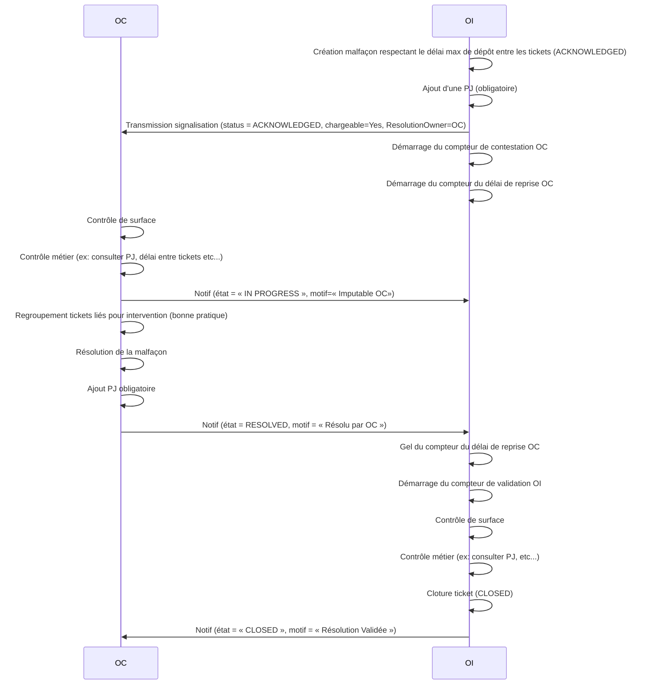

## Cas 2 (cas nominal) : Malfaçon imputable résolue par l’OC et non validée par l’OI dans les temps
Déclaration d'une malfaçon par l'OI à l’OC imputable et reprise par l’OC dans le délai max. de reprise OC. Lorsqu’il a effectué la reprise, l'OC passe le ticket en résolu avec en PJ n photos. L’OI valide la résolution de l’OC et clôt le ticket. L’OI ne valide pas la résolution de l’OC dans les temps. Le ticket est donc automatiquement clôturé.

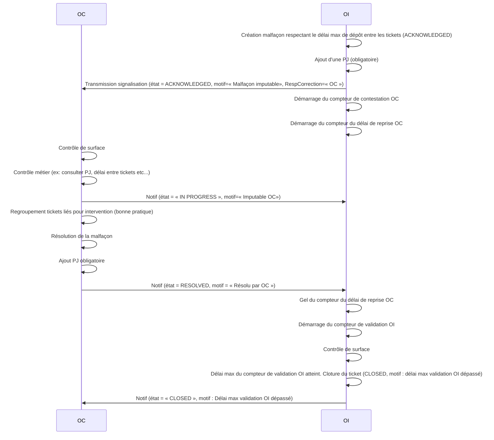

## Cas 3 : Malfaçon non-imputable (hors REC)
 L’OI signale la malfaçon à chaque OC présent sur l’infrastructure concernée pour information et leur indique leur quote-part. La malfaçon est reprise directement par l’OI qui clôt le ticket avec en PJ n photos et facture les OC au prorata.
La résolution est portée par l’OI.
L’OC ne valide pas la recevabilité du ticket ni sa résolution.
Si litige ou contestation, cela sera traité hors du cycle de vie du ticket lors de la certification des factures.
Aucun compteur n’est utilisé dans ce cas de gestion.
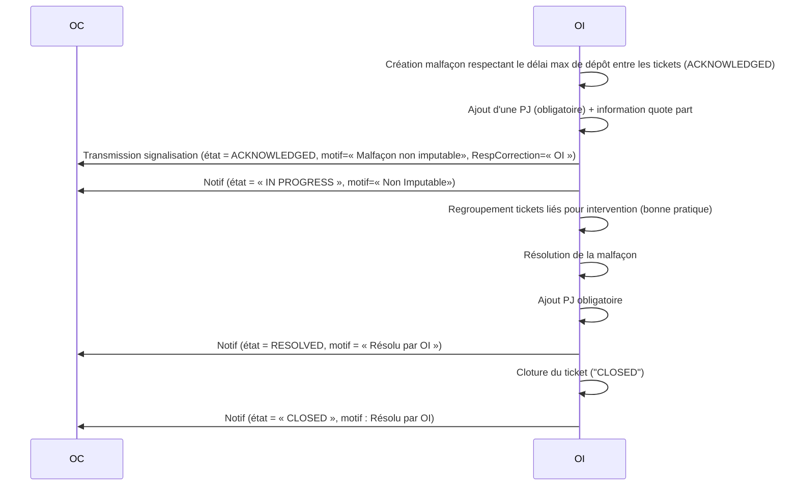

## Cas 4 : Malfaçon critique 
L’OI signale la malfaçon critique à l’OC pour information. La malfaçon est reprise directement par l’OI qui clôt le ticket avec en PJ n photos et facture l’OC.
La résolution est portée par l’OI.
L’OC ne valide pas la recevabilité du ticket ni sa résolution.
Si litige ou contestation, cela sera traité hors du cycle de vie du ticket lors de la certification des factures.
Aucun compteur n’est utilisé dans ce cas de gestion.
Pas de regroupement d’intervention OI car sévérité Critique nécessitant d’intervenir au plus tôt.

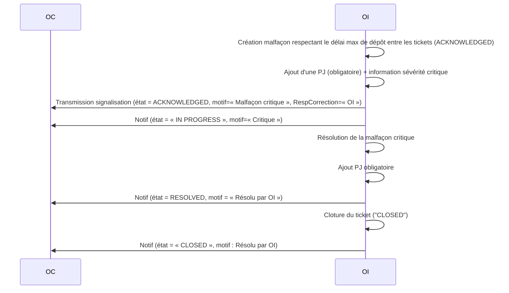

## Cas 5 : Malfaçon imputable avec reprise par OI suite au dépassement du délai de reprise OC, résolue par l’OI 
Déclaration d'une malfaçon par l'OI à l’OC imputable. L’OC ne reprend pas dans le délai max. de reprise OC. L’OI notifie l’OC  qu’il n’est plus nécessaire d’intervenir car la malfaçon va être reprise directement par l’OI. Quand l’OI a effectué la reprise, il clôt le ticket avec en PJ n photos et facture l’OC.
Compte-tenu de la non-reprise de la malfaçon par l’OC dans le délai qui lui est alloué, l’OI reprend la main.
L’OC ne valide pas la recevabilité du ticket ni sa résolution.
Si litige ou contestation, cela sera traité hors du cycle de vie du ticket lors de la certification des factures.

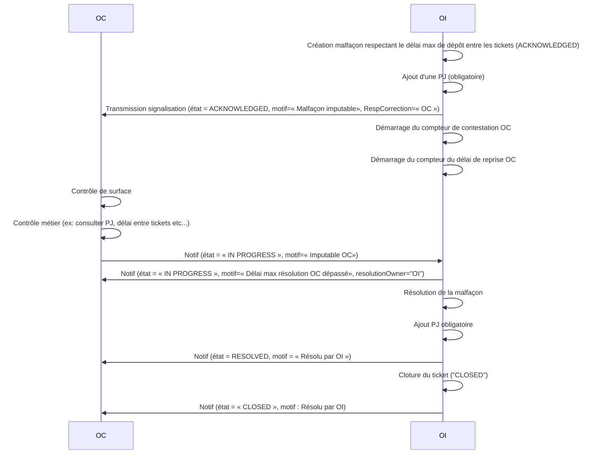

## Cas 6 : Malfaçon imputable avec reprise par OI suite au dépassement du délai de reprise OC MAIS non résolue par l’OI
Déclaration d'une malfaçon par l'OI à l’OC imputable. L’OC ne reprend pas dans le délai max. de reprise OC. L’OI notifie l’OC  qu’il n’est plus nécessaire d’intervenir car la malfaçon va être reprise directement par l’OI. L’OI n’effectue pas la reprise et clôture le ticket en non résolu. La malfaçon n’est pas facturée.

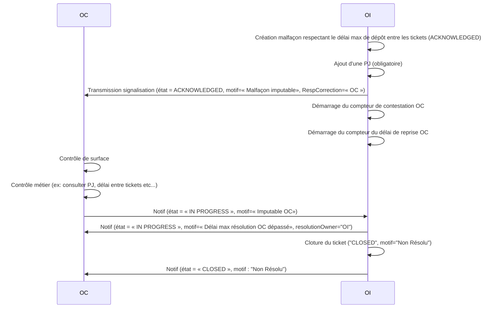

## Cas 7 : Demande d’information complémentaire de l’OI à l’OC suite à la résolution OC
Déclaration d'une malfaçon par l'OI à l’OC imputable et reprise par l’OC dans le délai max. de reprise OC. Lorsqu’il a effectué la reprise, l'OC passe le ticket en résolu avec en PJ n photos. L’OI demande des informations complémentaires à l’OC. Une fois ces informations reçues, l’OI valide la résolution de l’OC et clôt le ticket. L’OI devra donc valider le retour OC à plusieurs reprises, à priori 2 fois.
Suite au rejet de la résolution, le délai max. de reprise OC redémarre. L’OC a l’opportunité de compléter sa résolution en fournissant davantage d’informations à l’OI ou une nouvelle pièce-jointe.

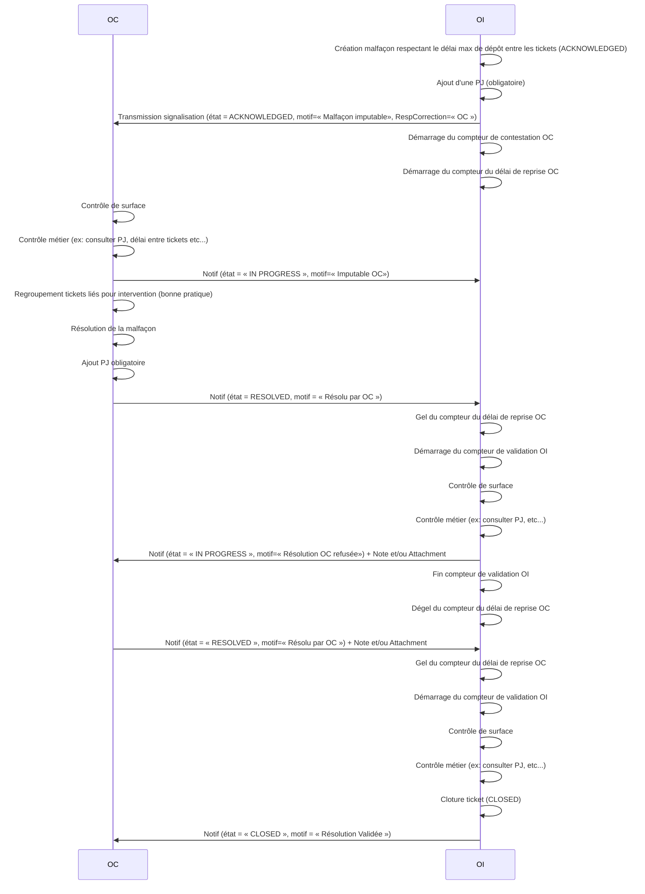

## Cas 8 : Demande d’information complémentaire de l’OC à l’OI suite à la réception du ticket
Déclaration d'une malfaçon par l'OI à l’OC imputable. L’OC demande des informations complémentaires à l’OI pour pouvoir traiter la malfaçon. Une fois que l’OI a fourni ces informations, l’OC enchaîne sur le cas 1 (cas nominal).
Suite à la réception du ticket, l’OC passe d’abord le ticket a « In Progress »’ puis demande ensuite des informations complémentaires à l’OI gelant par conséquent le délai max de reprise OC en attendant la réponse OI.

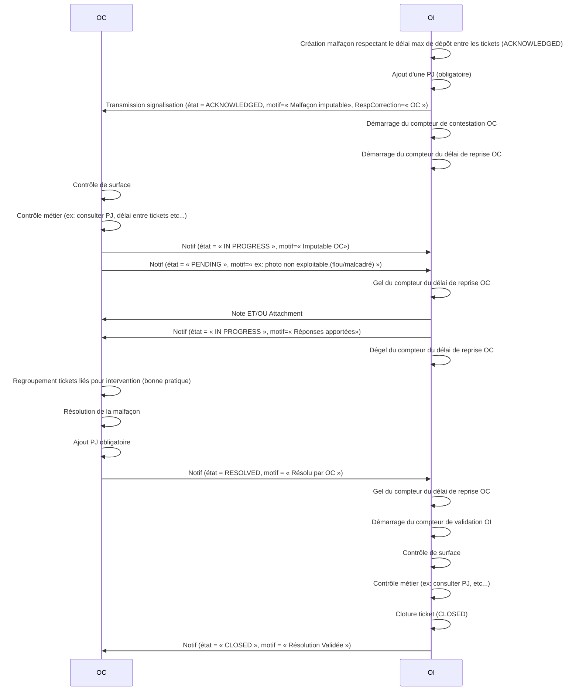

## Cas 9 : Rejet de la résolution OC par l’OI - Cas reprise complémentaire
Déclaration d'une malfaçon par l'OI à l’OC imputable. Lorsqu’il a effectué la reprise, l'OC passe le ticket en résolu avec en PJ n photos. L’OI rejette la reprise de la malfaçon faite par l’OC car la reprise est partielle (ex : 4 cordons à zéro ont été repris sur 6). Comme il n’a pas dépassé le délai max. de reprise OC, l’OC retourne sur le terrain pour compléter sa reprise initiale. L’OI devra donc valider le retour OC à plusieurs reprises, à priori 2 fois.

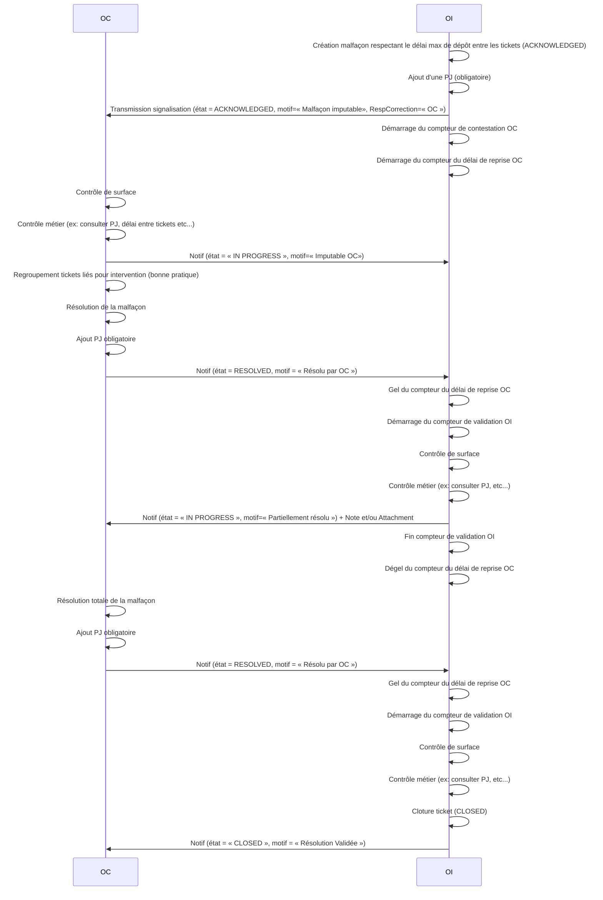

## Cas 10 : Contestation de l’OC de sa responsabilité
Déclaration d'une malfaçon par l'OI à l’OC imputable. L’OC conteste sa responsabilité et l’OI clôture automatiquement le ticket.
L’OI ne peut pas s’opposer au rejet de l’OC. L’OI analyse néanmoins la contestation de l’OC, il en découle 3 suites possibles :

1) L’OI n’est pas en phase avec la contestation OC et réouvre un ticket vers l’OC initial en lui expliquant pourquoi sa responsabilité est avérée
Donc Réouverture ticket via le « Cas 1 nominal » avec une nouvelle référence mais il est alors fait référence, dans les notes ou commentaires, à l’ancienne malfaçon « contestée » avec les anciennes ref OC et OI concernées.

2) L’OI est en phase avec la contestation OC et réouvre un ticket vers un autre OC jugé responsable
Donc Réouverture ticket via le « Cas 1 nominal » auprès du nouvel OC

3) Aucun OC n’est jugé responsable de la malfaçon et l’OI la reprend 
Donc Réouverture d’un ticket via le Cas 2 « Malfaçon non imputable »

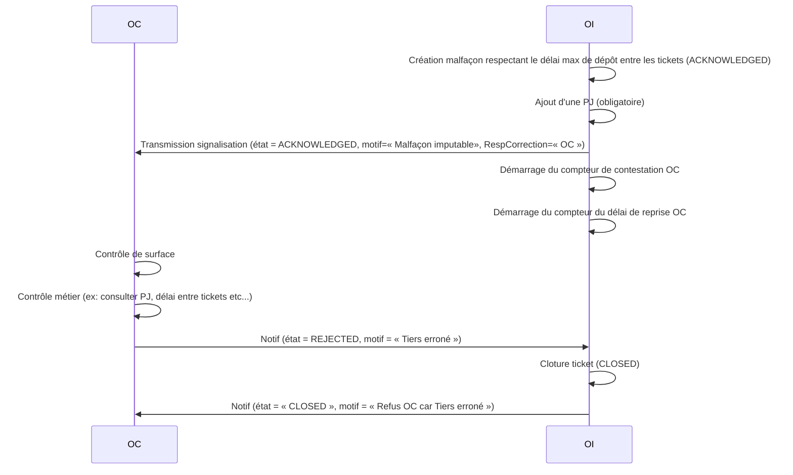

## Cas 11 : Annulation d'un ticket par l'OI 
Seul l'OI peut annuler un ticket, et celui-ci doit alors être à l'état Acknowledged ou Pending.

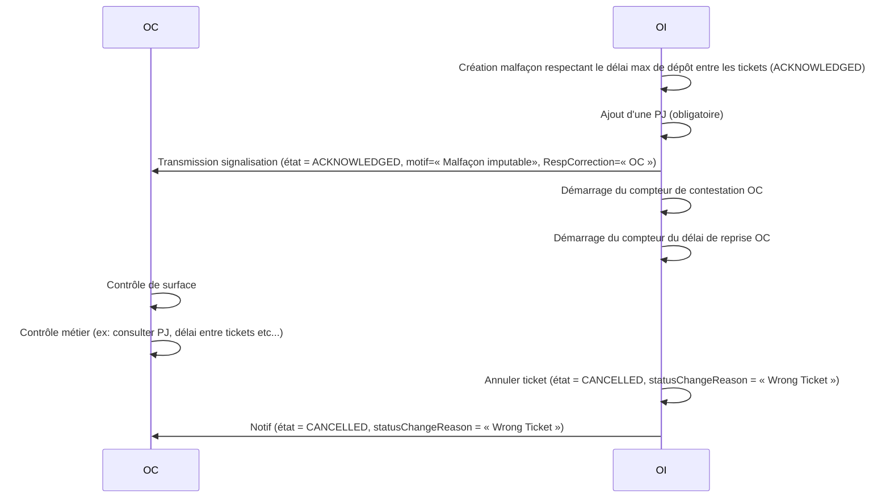

## Cas 12 : Mise en par l'OC suite à un incident technique ou problèmee environnemental (ex: PM inaccessible)
Seul l'OC peut passer un ticket en HELD dès lors qu'il lui est impossible de procéder à la résolution pour des raisons boquantes de type incident technique ou problèmee environnemental.
Le fait de passer le ticket en HELD gèle le compteur de résolution OC. Une fois le problème bloquant levé, l'OC doit repasser le ticket à In Progress.

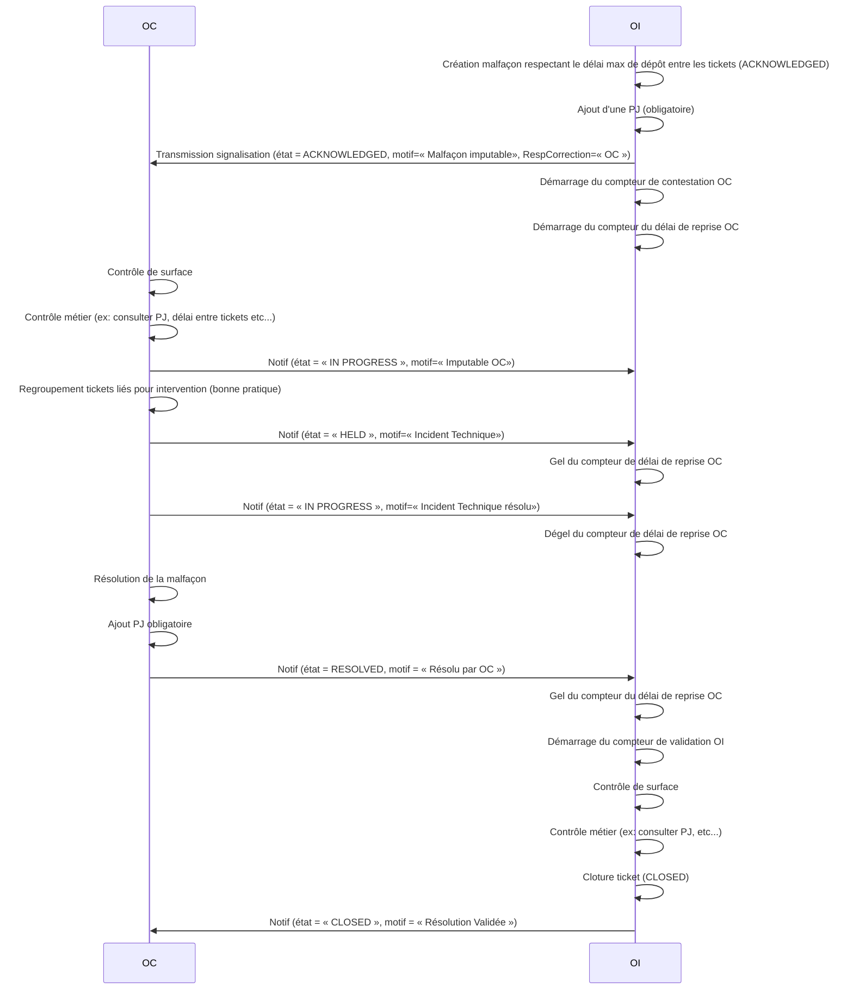

## Cas 13  : Malfaçon imputable, dépassement du délai de contestation OC, puis résolution OC
Déclaration d'une malfaçon par l'OI à l’OC imputable. Dans les 5 jours du délai de contestation, l'OC ne procède :
- ni à une contestation
- ni à un passage In Progress
L'OI bascule alors l'état du ticket à In Progress compte-tenu du dépassement du délai de contestation.
Par la suite, l'OC procède à la résolution (cf cas nominal).

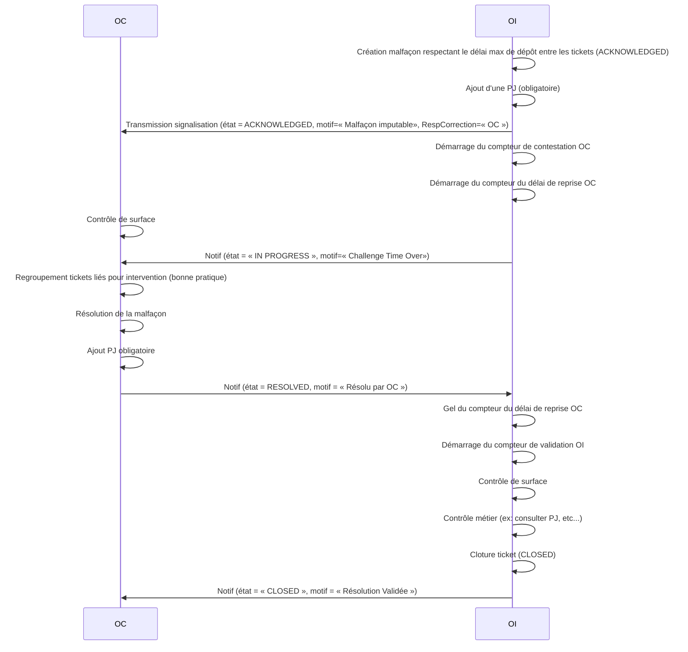

# Cas d'utilisation Signalisation OC

#### Cas 1 : Création du flux de signalisation OC -> OI 
Signalisation par l’OC constituant un input supplémentaire à prendre en compte par l'OI pour détecter des malfaçons.
Les données fournies dans la signalisation OC ne sont pas les mêmes que dans le cas de la détection par l’OI.
Suite à la signalisation par l’OC, l’OI ne partage pas de feedback avec l’OC concernant la reprise de cette malfaçon.
Il n’y a pas non plus d’engagement de traitement de la part de l’OI.
Ce ticket constitue un input supplémentaire à prendre en compte par l'OI pour détecter des malfaçons.

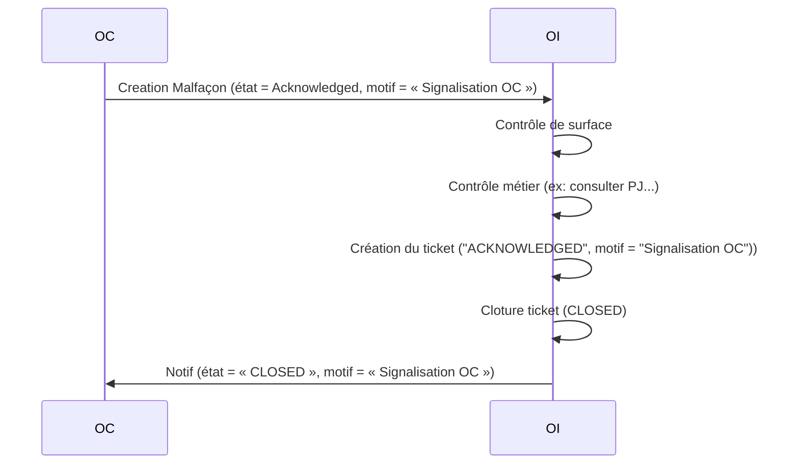

# Swagger
Le swagger est disponible à l'adresse suivante : https://ggrebert.github.io/malfacon/

Proposition de modification sur le swagger
0) gestion de la "malfaçon OC" très différente de la malfaçon OI en terme de cycle de vie + modèle donnée
1) Pas de ref OC comme sur ano adresse ==> échange / partage pour comprendre
2) Name ?  pas utile
3) Priority ? pas utile, nous c’est severity
4) relatedEntity ? Pas utile ?
5) relatedParty ? Pas utile ?
6) requestedResolutionDate ? pas utile car on utilise expectedResolutionDate ?
7) ticketType ? pas utile ?
8) Ajouter detectionDate en facultatif ?
9) Ajouter chargeable
10) Ajouter OcNumber
11) Ajouter resolutionOwner
12) Ajouter maxChallengeDate
13) Ajouter volumetryDone
14) Comment on trace que l’attachment est obligatoire à la création de la malfaçon --> photo / plan suivant type de malfaçon
15) Même question sur le resolved
16) Où trace-t-on les coordonnées XY et type associé ? C’est fait mais je trouve pas
17) Ajouter maxValidationDate
18) malfaçonOne ? malfaçonBase ?

# Requetes / KPI
KPI Arcep actuel :
Par type élément d'infra (PM ou raccordement) :
- nb de malfaçons PM reprises par l'OC - statut NOK au cours du mois (m)
- nb de malfaçons PM reprises par l'OC - statut OK au cours du mois (m)
  - dont délai OK, dont délai NOK
- nb de malfaçons PM reprises par l'OI au cours du mois (m)
- STOCK de malfaçons non reprises

En élargissant, il doit être possible de fournir à un petit OC les réponses aux requêtes suivantes :

Sur les En cours :
	- Les en cours pour un OC
	- Par statut
	- Par equipement
  - dont le délai de résolution est encore OK
	- dont le délai de résolution est KO
	- crée  depuis la date X ou entre X et Y
	- résolu OC mais non encore validé OI

Sur la totalité des tickets :
- combien ont été créés depuis le X ?
- combien ont été cloturées depuis le X ?
- Combien ont résolu par OC ?
    - dans les délais de résolution
    - au dela des délais de résolution
- Combien créés entre tel et tel date sur tel element d'infra ?
