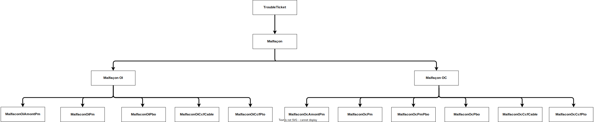
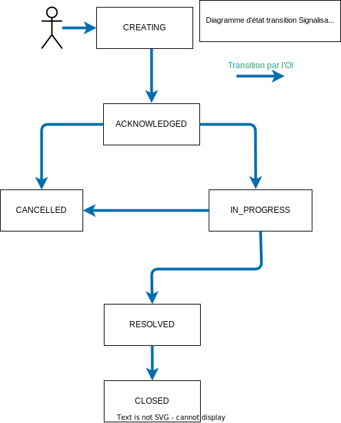

# Protocole Interop Malfaçon

# Table des matières
1. [Introduction](#introduction-api-malfaçon)
 ### 2. Malfaçon signalée par l'OI vers l'OC
 #### 2.1 Malfaçon "Imputable" signalée par l'OI vers l'OC
 2.1.1 [Cycle de vie et règles de transition entre états](#imputable--cycle-de-vie-dune-malfaçon-oi-vers-oc)

2.1.2 [Gestion des compteurs](#liste-des-différents-compteurs-utilisés-dans-le-process-malfaçons)
 #### 2.2 Malfaçon "Non Imputable" ou "Critique" signalée par l'OI vers l'OC
2.2.1 [Cycle de vie et règles de transition entre états](#non-imputable-ou-critique--cycle-de-vie-dune-malfaçon-oi-vers-oc)
#### 2.3 Diagrammes de séquence de cas d'utilisation de Malfaçons signalée par l'OI vers l'OC
2.3.1 [Diagramme de séquence des 11 Cas d'utilisation](#cas-dutilisation-signalisation-oi)
#### 2.4. Modèle de donnée d'une malfaçon OI vers OC
2.4.1 [Modèle de données](#modèle-de-données-signalisation-oi-vers-oc)
### 3. Malfaçon signalée par l'OC vers l'OI
3.1 [Cycle de vie](#cycle-de-vie-dune-malfaçon-oc-vers-oi)

3.2 [Diagramme de séquence du cas d'utilisation](#cas-dutilisation-signalisation-oc)

3.3 [Modèle de données](#modèle-de-données-signalisation-oc-vers-oi)

# Introduction API Malfaçon
Cette API permet la déclaration et le traitement d’une malfaçon grâce à des flux normalisés :

Une malfaçon est une non-conformité par rapport aux STAS (Spécification Technique d’Accès aux Services) ou règles de l’art, issue de travaux menés dans le cadre d'une prestation de production ou de SAV sur un accès (PM/PBO/PTO). Les malfaçons que l’on constate le plus souvent sont : un non-respect du cheminement de la jarretière, une non-conformité de la jarretière (couleur, diamètre, longueur…) mais aussi des déchets laissés sur place (sachet plastique, chute de jarretière…) ou des dégradations (serrure cassée…). La Malfaçon se distingue de la notion de dysfonctionnement dont est ici rappelée la définition Interop’Fibre : un dysfonctionnement est une problématique qui rend impossible l’adduction du réseau d’un OC au PM mis à disposition par un OI.

Structurant : Un signalisation est créée par typologie de malfaçon et par OC imputable, sans regroupement par élément d’infra.

Les signalisations peuvent être :
1) De l'OI vers l'OC :

Cas 1 : Malfaçon imputable de l'OI vers l'OC : reprise attendue de la part de l'OC

Il s'agit alors de Malfaçon non critique imputable à un seul OC : c'est alors une notification appelant action corrective de la part de l’OC destinataire. Si l'OC ne corrige pas dans les délais attendus, alors l'OI effectue la correction lui-même et facturera l'OC pour cela.

Cas 2 : Malfaçon "Critique" ou "non imputable" à un seul OC : la reprise est effectuée par l'OI

Dans ces deux sous-cas ci-dessous, l'OI corrige la malfaçon lui-même et facturera l'OC (ou les OC suivant le sous cas):

Sous-Cas 2.1 : Malfaçon critique : c'est alors une notification à l'OC n’appelant pas action de sa part car la reprise sera effectuée par l'OI compte-tenu de son aspect critique (c’est-à-dire pouvant présenter un danger grave et imminent pour les personnes et entrainer la responsabilité de l'OI à ce titre). L'aspect "Critique" de la malfaçon doit alors être conforme aux travaux Interop (cf onglet criticité du fichier excel listant les données de référence).

Sous-Cas 2.2 : Malfaçon non imputable à un seul OC : c'est alors une notification à l'ensemble des OC concernés n’appelant pas d'action de leur part car la reprise sera effectuée par l'OI

2) De l'OC vers l'OI :

L'OC informe l'OI pour que celui-ci dépose une signalisation vers l'OC responsable. L’OC a l’origine de la remontée initiale ne suit pas le cycle de vie de la malfaçon et ne sera pas informé de la reprise de la malfaçon qu’il a signalée.  La signalisation de la malfaçon par un OC vers un OI est une remontée d’information qui n’implique pas d’engagement de l’OC sur son niveau de précision : cette signalisation constitue une information complémentaire pour l’OI dans le cadre de l’exploitation de son réseau.

## Swagger

A construire suite à la validation fonctionnelle

## Types de Malfaçons
Les différents types de malfaçons sont :

# Cycle de vie d'une Malfaçon Imputable OI vers OC non critique

#### Initialisation : statut CREATING
Une signalisation est créée par l’OI et porte l’information ResolutionOwner = ‘OC’.
A ce stade la signalisation n'est pas complète puisqu'aucune pièce jointe n'a été ajoutée au ticket.

L'OI a renseigné les champs :
- resolutionOwner = OC
- chargeable : yes
- type
- localisationDetails
- faultDetails
- volumetry
- severity (ne peut pas être Critical puisque chargeable=Yes)
- les informations de localisation de la Malfaçon (ref PM et/ou ref PB et/ou ref PTO)
- ocNumber = 1

Le champs statusChangeReason = Creating

#### Complétude : statut ACKNOWLEDGED
La signalisation porte obligatoirement une pièce jointe illustrant la malfaçon.
Pour les malfaçons de type AmontPm, Pm, PmPbo, Pbo, cette pièce jointe est obligatoirement une photo.
Pour les types CcfCable et CcfPto, la pièce jointe peut être une photo ou un plan.
Le compteur de délai max de reprise/résolution OC (totalResolutionOcDuration) démarre dès ce statut (ex 30 jours).
Le champs statusChangeReason = Acknowledged

Possibilités de changement de status:

#### ACKNOWLEDGED → REJECTED: Le ticket n'est pas jugé recevable par l'OC

Ce changement ne peut être effectué que par  l'OC et uniquement si le ticket est invalide

Les raisons (statusChangeReason) possibles sont:

UNKNOWN_RESOURCE: la ressource n'existe pas chez l'OC

DUPLICATE: le ticket est en conflit avec un autre ticket (non respect du délai max de dépôt entre les tickets auprès d’un même OC sur un même élément d’infra ). Le champ statusChangeDetails est obligatoire avec la référence du ticket en conflit.

ORDER_PUT_INTO_SERVICE_FOR_MORE_THAN_A_YEAR : la commande d'accès date d'il y a plus d'un an

INVALID: le ticket est jugé invalide et non analysable par l'OC.
Le champ statusChangeDetails est obligatoire.

#### ACKNOWLEDGED → IN_PROGRESS: Le ticket est en cours de résolution

Ce changement est effectué par  l'OC et il n'est plus possible de passer le ticket à REJECTED une fois ce changement de statut effectué.

Le champ statusChangeReason doit être renseigné avec Chargeable_Accepted.

#### IN_PROGRESS → IN_PROGRESS: l'OI prend en charge la résolution du ticket suite dépassement délai OC
Ce changement de status ne peut être effectué que par l'OI lorsque le délai de résolution par l'OC est dépassé (totalResolutionOcDuration > délai fixé).

L'OI doit alors :
- modifier le champs resolutionOwner qui doit être renseigné à "OI"
- Le champ statusChangeReason doit être renseigné avec RESOLUTION_DATE_EXPIRED

#### IN_PROGRESS → PENDING: demande OC d'information complémentaire à l'OI
Ce changement de statut ne peut être effectué que par l'OC sur une malfaçon dont le ResolutionOwner='OC'.
Cette transition a pour effet de geler le compteur totalResolutionOcDuration.
L'OI a alors un délai maximum pour apporter sa réponse : maxPendingDate

Le champ statusChangeReason doit être renseigné avec  :

PHOTO_NOT_USABLE : Photo non exploitable (flou mal cadré)

PM_ERROR : Confusion entre identification du PM et PM déclaré

CONTESTATION : cette transition n’est possible qu’une et une seule fois par l'OC, sinon rejet OI

OTHER : Autre information attendue

L'OC doit fournir le détail des informations complémentaires attendues dans le champs statusChangeDetails.

#### PENDING → IN_PROGRESS: réponse OI à une demande d'information complémentaire OC
Ce changement de status ne peut être effectué que par l'OI et dans un délai inférieur au maxPendingDate.
Cette transition a pour effet de dégeler le compteur totalResolutionOcDuration.

Le champ statusChangeReason doit être renseigné avec la valeur INFORMATION_GIVEN

L'OI fournit la liste des informations complémentaires attendues:
- soit dans le champ statusChangeDetails
- et/ou une note
- et/ou un attachment

#### PENDING → RESOLVED: absence de réponse OI dans les délais
Ce changement de status ne peut être effectué que par l'OI (automatiquement) lorsque le délai de réponse OI a été dépassé (maxPendingDate).
En absence de réponse OI, le ticket passe automatiquement en Resolved avec le champ statusChangeReason renseigné à  DELAY_ANSWER_EXPIRED

#### IN_PROGRESS → RESOLVED: résolution du ticket

Sur un ticket dont le champs resolutionOwner='OI', ce changement de status ne peut être effectué que par l'OI. Le champ statusChangeReason doit être renseigné avec RESOLVED_OI.

Sur un ticket dont le champs resolutionOwner='OC', ce changement de status ne peut être effectué que par l'OC. Le champ statusChangeReason doit être renseigné avec RESOLVED_OC. Le compteur de délai de résolution OC (totalResolutionOcDuration) se gèle et le délai max de validation OI (maxValidationDate) est alors calculé.

Sur ces statusChangeReason = Resolved_OI ou Resolved_OI :
- le champs resolutionDate doit être renseigné
- ainsi que le champs recoveryVolumeDone
- une photo illustrant la résolution de la malfaçon est obligatoire

#### ACKNOWLEDGED|IN_PROGRESS|PENDING → CANCELLED : annulation du ticket par l'OI
Ce changement de status ne peut être effectué que par l'OI, et quel que soit le porteur de la résolution (ResolutionOwner), qu'il soit OI ou OC.
Cela peut faire suite à une mauvaise initialisation, ou à des échanges OC/OI en cours de vie du ticket.

Le champs statusChangeReason doit être renseigné avec :

REC_CANDIDATE : Malfaçon à requalifier en REC

WRONG_TICKET :  ticket mal initialisé/contestation acceptée

UNRESOLVED_TICKET :  ticket qui ne sera pas résolu
Le champ statusChangeDetails doit être renseigné avec la raison de l'annulation.

OTHER :  Autre raison
Le champ statusChangeDetails doit être renseigné avec la raison de l'annulation.

#### RESOLVED → CLOSED: cloture du ticket.

Ce changement de status est effectué par l'OI :

- par validation explicite de la résolution OC par l'OI sur un ticket dont le ResolutionOwner='OC'
Le champ statusChangeReason doit alors être renseigné avec la valeur RESOLUTION_ACCEPTED.

- ou de façon automatique si le délai de validation OI (totalResolutionOcDuration>délai) est dépassé sur un ticket dont le ResolutionOwner='OC'.
Le champ statusChangeReason doit alors être renseigné avec la valeur DELAY_VALIDATION_EXPIRED

- ou enfin pour cloturer une signalisation dont la résolution est portée par l'OI (ResolutionOwner='OI')
Le champ statusChangeReason doit alors être renseigné avec la valeur RESOLUTION_ACCEPTED

#### RESOLVED → IN_PROGRESS: refus OI de la résolution OC du ticket

Ce changement de status ne peut être effectué que par l'OI sur un ticket dont le ResolutionOwner='OC' et que l'OC indique avoir résolu la malfaçon (état resolved + statusChangeReason à Resolved_OC).

Cette transition a pour effet de dégeler le compteur totalResolutionOcDuration.

Le champ statusChangeReason doit être renseigné avec la valeur RESOLUTION_REFUSED.

Le champ statusChangeDetails doit être renseigné avec la raison du refus.

## Liste des différents compteurs utilisés dans le process malfaçons lors d'une signalisation OI vers OC
Le protocole Interop n’harmonise pas les délais car ils relèvent du domaine contractuel propre à chaque opérateur. Néanmoins, les opérateurs doivent mettre en place des délais pour les cas décrits ci-dessous. Les valeurs sont propres à chaque OC/OI et seront formalisées dans les contrats.
L'ensemble de ces délais sont exprimés en jours calendaires, et les différentes dates échangés dans le cadre de ce protocle devront être exprimées en UTC.

### Délai max de reprise OC :
Compteur totalResolutionOcDuration qui démarre au passage du ticket à Acknowledged qui correspond à la transmission de la signalisation par l’OI.
Ce délai correspond au temps maximum alloué à l’OC pour résoudre la malfaçon.
Ce délai peut cependant s’allonger suite à l’application de « gels » :
- Quand l’OC demande des compléments d’informations à l’OI pour traiter la malfaçon, le compteur de reprise OC est gelé le temps que l’OI réponde à la sollicitation.
- Lorsque l’OC a effectué la reprise de la malfaçon (passage du ticket à Resolved), le compteur est gelé le temps que l’OI analyse la reprise OC. En cas de rejet de résolution, le compteur redémarrera là où il en était et l’OC pourra réitérer sa reprise dans les jours restants.

### Délai max de validation OI :
Est calculé lors de la réception par l’OI de la résolution envoyée par l’OC (passage du ticket à Resolved)
Ce délai correspond au temps maximum alloué à l’OI pour valider ou non, la résolution par l’OC.
Ce délai de validation OI gèle le délai de reprise OC (totalResolutionOcDuration) et laisse ainsi l’opportunité à l’OC de réitérer sa reprise dans les jours restants au compteur si sa reprise initiale n’est pas conforme.
Une fois ce délai dépassé, la résolution est considérée comme automatiquement validée par l’OI et le ticket doit être clôturé. Une fois le ticket clôturé, l’OI ne pourra pas facturer l’OC s’il n’est pas satisfait de sa reprise. Il devra alors ouvrir un nouveau ticket, patienter le délai de reprise OC et, si de nouveau la reprise OC ne lui convient pas, exprimer le refus de validation dans le délai imparti pour ensuite reprendre la malfaçon et facturer l’OC.

### Délai max de réponse OI :
Est calculé lors d'une question posée par l'OC à l'OI (passage du ticket à Pending)
L'OI a alors un délai fixé (maxPendingDate) pour apporter la réponse à l'OC qui est en attente de celle-ci. Si cette date est dépassée, le ticket passe alors automatiquement en Resolved.

### Délai max de dépôt entre les tickets auprès d’un même OC sur un même élément d’infra (Gestion des compléments de signalisations) :
Il ne s'agit pas ici d'un compteur, mais plutôt d'une règle de gestion.
Afin d’optimiser les interventions terrains, l’OI doit veiller à signaler l’ensemble des malfaçons auprès d’un même OC sur un « même élément d’infra* » dans un « délai max de dépôt entre les tickets ».

Tout ticket au-delà pourra être rejeté par l’OC dès lors qu'il a déjà un ticket sous sa responsabilité en cours sur cet élément d'infra.

Remarque : Elément d’infra = PM / PB et CCF

# Cycle de vie d'une Malfaçon Non imputable ou Critique de l'OI vers OC

#### Initialisation : statut CREATING
Une signalisation est créée par l’OI et porte l’information ResolutionOwner = ‘OI’.
A ce stade la signalisation n'est pas complète puisqu'aucune pièce jointe n'a été ajoutée au ticket.

L'OI a renseigné les champs :
- resolutionOwner = OI
- type
- localisationDetails
- faultDetails
- volumetry
- severity (doit être Critical si chargeable=Yes car résolution portée par l'OI)
- les informations de localisation de la Malfaçon (ref PM et/ou ref PB et/ou ref PTO)
- chargeable : yes or no
- nombre d'OC concerné

Le champs statusChangeReason = Creating

#### Complétude : statut ACKNOWLEDGED
Une signalisation porte obligatoirement une pièce jointe illustrant la malfaçon.
Pour les malfaçons de type AmontPm, Pm, PmPbo, Pbo, cette pièce jointe est obligatoirement une photo.
Pour les types CcfCable et CcfPto, la pièce jointe peut être une photo ou un plan.
Le champs statusChangeReason = Acknowledged

Possibilités de changement de status:

#### ACKNOWLEDGED → IN_PROGRESS: Le ticket est en cours de résolution

Ce changement de statut est effectué par  l'OI et le champ statusChangeReason doit être renseigné avec statusChangeReason = "Non_Chargeable_In_Progress" si chargeable = No, Critical_In_Progress sinon

#### ACKNOWLEDGED|IN_PROGRESS → CANCELLED : annulation du ticket par l'OI
Ce changement de status est effectué par l'OI.

Le champs statusChangeReason doit être renseigné avec :

REC_CANDIDATE : Malfaçon à requalifier en REC

WRONG_TICKET :  ticket mal initialisé

UNRESOLVED_TICKET :  ticket qui ne sera pas résolu
Le champ statusChangeDetails doit être renseigné avec la raison de l'annulation.

OTHER :  autre raison
Le champ statusChangeDetails doit être renseigné avec la raison de l'annulation.

#### IN_PROGRESS → RESOLVED: résolution du ticket

Ce changement de status ne peut être effectué que par l'OI. Le champ statusChangeReason doit être renseigné avec RESOLVED_OI.

Le champs resolutionDate doit être renseigné ainsi que le champs recoveryVolumeDone.
Une photo jointe illustrant la résolution de la malfaçon est obligatoire

#### RESOLVED → CLOSED

Ce changement de status est effectué par l'OI suite à sa propre résolution sur un ticket dont le ResolutionOwner='OI'.

Le champ statusChangeReason doit alors être renseigné avec la valeur RESOLUTION_ACCEPTED

# Cas d'utilisation Signalisation OI
Ces diagrammes se concentrent sur la signalisation et la correction des malfaçons. Toute malfaçon corrigée par l’OI donnera lieu à une facturation vers l’OC ou les OC concernés (si non-imputable), mettant en œuvre les processus de facturation OI et de certification OC existants.
Les cas d'utilisation détaillés par la suite sont les suivants :

#### Cas 1 : Cas nominal, Malfaçon imputable résolue par l’OC et validée par l’OI
#### Cas 2 : Malfaçon imputable résolue par l’OC et non validée par l’OI dans les temps
#### Cas 3 : Malfaçon non-imputable (hors REC)
#### Cas 4 : Malfaçon critique 
#### Cas 5 : Malfaçon imputable avec reprise par OI suite au dépassement du délai de reprise OC, résolue par l’OI 
#### Cas 6 : Malfaçon imputable avec reprise par OI suite au dépassement du délai de reprise OC MAIS non résolue par l’OI
#### Cas 7 : Demande d’information complémentaire de l’OI à l’OC suite à la résolution OC
#### Cas 8 : Demande d’information complémentaire de l’OC à l’OI suite à la réception du ticket
#### Cas 9 : Rejet de la résolution OC par l’OI - Cas reprise complémentaire réalisée par l'OC
#### Cas 10 : Contestation de l’OC de sa responsabilité sur réception de la signalisation acceptée par l'OI
#### Cas 11 : Annulation d'un ticket par l'OI 

## Cas 1 (cas nominal) : Malfaçon imputable résolue par l’OC et validée par l’OI
Déclaration d'une malfaçon par l'OI à l’OC imputable et reprise par l’OC dans le délai max. de reprise OC. Lorsqu’il a effectué la reprise, l'OC passe le ticket en résolu avec en PJ n photos. L’OI valide la résolution de l’OC et clôt le ticket.

## Cas 2 (cas nominal) : Malfaçon imputable résolue par l’OC et non validée par l’OI dans les temps
Déclaration d'une malfaçon par l'OI à l’OC imputable et reprise par l’OC dans le délai max. de reprise OC. Lorsqu’il a effectué la reprise, l'OC passe le ticket en résolu avec en PJ n photos. L’OI valide la résolution de l’OC et clôt le ticket. L’OI ne valide pas la résolution de l’OC dans les temps. Le ticket est donc automatiquement clôturé.

## Cas 3 : Malfaçon non-imputable (hors REC)
 L’OI signale la malfaçon à chaque OC présent sur l’infrastructure concernée pour information et le nombre d'OC présent afin que chacun connaisse sa quote-part. La malfaçon est reprise directement par l’OI qui clôt le ticket avec en PJ n photos et facture les OC au prorata.
La résolution est portée par l’OI.
L’OC ne valide pas la recevabilité du ticket ni sa résolution.
Si litige ou contestation, cela sera traité hors du cycle de vie du ticket lors de la certification des factures.
Aucun compteur n’est utilisé dans ce cas de gestion.

## Cas 4 : Malfaçon critique 
L’OI signale la malfaçon critique à l’OC pour information. La malfaçon est reprise directement par l’OI qui clôt le ticket avec en PJ n photos et facture l’OC.
La résolution est portée par l’OI.
L’OC ne valide pas la recevabilité du ticket ni sa résolution.
Si litige ou contestation, cela sera traité hors du cycle de vie du ticket lors de la certification des factures.
Aucun compteur n’est utilisé dans ce cas de gestion.
Pas de regroupement d’intervention OI car sévérité Critique nécessitant d’intervenir au plus tôt.

## Cas 5 : Malfaçon imputable avec reprise par OI suite au dépassement du délai de reprise OC, résolue par l’OI 
Déclaration d'une malfaçon par l'OI à l’OC imputable. L’OC ne reprend pas dans le délai max. de reprise OC. L’OI notifie l’OC  qu’il n’est plus nécessaire d’intervenir car la malfaçon va être reprise directement par l’OI. Quand l’OI a effectué la reprise, il clôt le ticket avec en PJ n photos et facture l’OC.
Compte-tenu de la non-reprise de la malfaçon par l’OC dans le délai qui lui est alloué, l’OI reprend la main.
L’OC ne valide pas la recevabilité du ticket ni sa résolution.
Si litige ou contestation, cela sera traité hors du cycle de vie du ticket lors de la certification des factures.

## Cas 6 : Malfaçon imputable avec reprise par OI suite au dépassement du délai de reprise OC MAIS non résolue par l’OI
Déclaration d'une malfaçon par l'OI à l’OC imputable. L’OC ne reprend pas dans le délai max. de reprise OC. L’OI notifie l’OC  qu’il n’est plus nécessaire d’intervenir car la malfaçon va être reprise directement par l’OI. L’OI n’effectue pas la reprise et clôture le ticket en non résolu. La malfaçon n’est pas facturée.

## Cas 7 : Demande d’information complémentaire de l’OI à l’OC suite à la première résolution OC
Déclaration d'une malfaçon par l'OI à l’OC imputable et reprise par l’OC dans le délai max. de reprise OC. Lorsqu’il a effectué la reprise, l'OC passe le ticket en résolu avec en PJ n photos. L’OI refuse la correction en demandant des informations complémentaires à l’OC. L'OC les fournit en repassant la signlisation à Resolved. L'OI valide la résolution de l’OC et clôt le ticket.

## Cas 8 : Demande d’information complémentaire de l’OC à l’OI suite à la réception du ticket
Déclaration d'une malfaçon par l'OI à l’OC imputable. L’OC demande des informations complémentaires à l’OI pour pouvoir traiter la malfaçon. Une fois que l’OI a fourni ces informations, l’OC enchaîne sur le cas 1 (cas nominal).
Suite à la réception du ticket, l’OC passe d’abord le ticket a « In Progress »’ puis demande ensuite des informations complémentaires à l’OI gelant par conséquent le délai max de reprise OC en attendant la réponse OI.

## Cas 9 : Rejet de la résolution OC par l’OI - Cas reprise complémentaire réalisée par l'OC
Déclaration d'une malfaçon par l'OI à l’OC imputable. Lorsqu’il a effectué la reprise, l'OC passe le ticket en résolu avec en PJ n photos. L’OI rejette la reprise de la malfaçon faite par l’OC car la reprise est partielle (ex : 4 cordons à zéro ont été repris sur 6). Comme il n’a pas dépassé le délai max. de reprise OC, l’OC retourne sur le terrain pour compléter sa reprise initiale. L’OI devra donc valider le retour OC à plusieurs reprises, à priori 2 fois.

## Cas 10 : Contestation de l’OC de sa responsabilité acceptée par l'OI
Déclaration d'une malfaçon par l'OI à l’OC imputable. L’OC conteste sa responsabilité, en passant tout d'abord la malfaçon à In Progress puis en indiquant son motif de contestation lors d'un passage en Pending pour gel du compteur de reprise OC. L'OI analyse alors la contestation OC et peut décider d'annuler, ou de de refuser, la contestation OC.
L'OC ne peut passer le statusChangeReason="Contestation" qu'une et une seule fois vers l'OI.

## Cas 11 : Annulation d'un ticket par l'OI 
Seul l'OI peut annuler un ticket, et celui-ci doit alors être à l'état Acknowledged, Pending ou In Progress.

# Modèle de données Signalisation OI vers OC
Le modèle de donnée est disponible dans le fichier Excel RéférentielMalfaçonVersionGitHub.xlsx :
1) L'onglet "Modèle de données Malfaçon OI" présente l'ensemble des champs
2) L'onglet "Valeurs possibles" présente les valeurs possibles pour les champs "liste de valeur"
3) L'onglet Criticité présente les règles permettant de fixer la valeur Critique/Majeur/Mineur

# Cycle de vie d'une Malfaçon OC vers OI

### Initialisation : statut CREATING
Une signalisation est créée par l’OC qui souhaite porter l’information à l'OI d'une potentielle malfaçon. A ce stade la signalisation n'est pas complète puisqu'aucune pièce jointe n'a été ajoutée au ticket.

L'OC a renseigné les champs :
- type
- localisationDetails
- faultDetails
- volumetry
- les informations de localisation de la Malfaçon (ref PM et/ou ref PB et/ou ref PTO)

Le champs statusChangeReason = Creating

### Complétude : statut ACKNOWLEDGED
La signalisation porte obligatoirement une photo illustrant la malfaçon.
Le champs statusChangeReason = Acknowledged

Possibilités de changement de status:

#### ACKNOWLEDGED → CLOSED

Ce changement de status ne peut être effectué que par l'OI.

Le champs statusChangeReason doit être renseigné avec :

Defect_Communicated_By_Oc :  Signalisation OC d'une malfaçon

L'OI ne doit aucun retour à l'OC sur le traitement potentiel qui sera réalisé sur cette signalisation.

# Cas d'utilisation Signalisation OC

#### Cas 1 : Création du flux de signalisation OC -> OI 
Signalisation par l’OC constituant un input supplémentaire à prendre en compte par l'OI pour détecter des malfaçons.
Les données fournies dans la signalisation OC ne sont pas les mêmes que dans le cas de la détection par l’OI.
Suite à la signalisation par l’OC, l’OI ne partage pas de feedback avec l’OC concernant la reprise de cette malfaçon.
Il n’y a pas non plus d’engagement de traitement de la part de l’OI.
Ce ticket constitue un input supplémentaire à prendre en compte par l'OI pour détecter des malfaçons.

# Modèle de données Signalisation OC vers OI
Le modèle de donnée est disponible dans le fichier Excel RéférentielMalfaçonVersionGitHub.xlsx (onglet "Modèle de données Malfaçon OC")